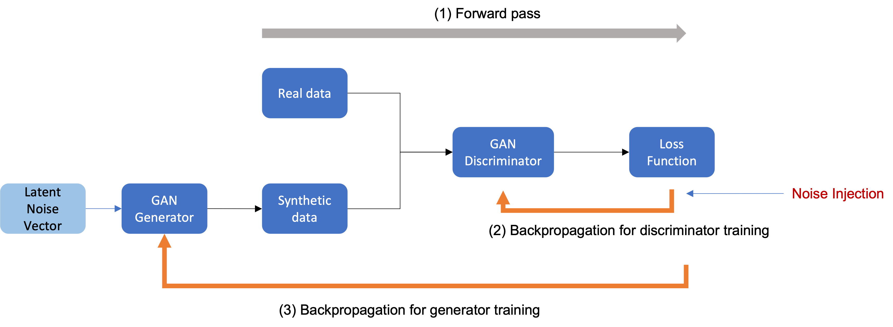

# differential-privacy 
Apply Differential Privacy on Bank Credit Card Fraud Detection Dataset

### Team:
**Krishna Kumar & Sumit Machwe**\
_Georgia Institute of Technology_  
_Atlanta, Georgia_ \
`kkumar80@gatech.edu` | `smachwe3@gatech.edu`

# Introduction
`Differential Privacy` ensures to protect the private data such as social security numbers, age, gender, or any sensitive information (PII - Personally Identifiable Information) which can identify the individual persons in the dataset. This has wide applicability in domains such as finance, healthcare, demographic data, etc.[1](https://cloudblogs.microsoft.com/opensource/2021/02/18/create-privacy-preserving-synthetic-data-for-machine-learning-with-smartnoise/).

Our project demonstrates the use of Differential Privacy on a Bank Credit Card Fraud detection dataset provided on Kaggle [2](https://www.kaggle.com/datasets/sgpjesus/bank-account-fraud-dataset-neurips-2022). This will improve the fraud detection identification by encouraging banks, financial institutions to share the data in a differential private way, so that federated learning can be done for fraud detection and solve the class imbalance (less percentage of fraud for individual bank). 
Given above dataset, our project will generate a synthetic dataset that will have `Distributional Similarity` as real dataset, and `Machine Learning Utility` which could be sub-optimal to the real dataset performance by some threshold. We demostrate distributional similarity using KDE Plots and feature correlation plots. ML utility will be demonstrated by comparing performance of real vs. synthetic dataset using `AUC` and `F1 score`.

**Please refer to the Final Report for details:** [Final Report](report/Final_Report_Differential_Privacy.pdf)  

Refer to [`/notebooks`](src/notebooks/) for code.

# Approach

**EDA:** Analyze and visualize the dataset. Cleanup null values, convert datatypes, identified categorical variables and visualize the data distribution. 
We realized that the original dataset was 1 million records with more than 40 columns. Given the compute resource limitations we decided to reduce the data size from 1 million to 300,000 records. 
We used the `stratify` parameter of the train_test_split of sklearn library on `FRAUD_BOOL` label. 
We also reduced the number of columns (features) based on correlation plot, retaining any feature that has `±0.2` correlation with FRAUD_BOOL. This also helped to avoid Multicollinearity.

**Baseline ML Utility**: We trained `Random Forest`, `Naive Bayes` and `Logistic Regression` models on the real (reduced) dataset. Evaluated and plotted the `Precision`, `Recall`, `F1 score` and `AUC/ROC`. 
This provided us the ML utility baseline performance. This should act as an upperbound on the `synthetic dataset` generated by our our implementation of Differential Privacy.

**Main Algorithm for Differential Privacy**: Differential Privacy is a randomized algorithm (K), which gives
`ε-differential` privacy if for all data sets D and D′ differing on at most one row, and any S ⊆ Range(K) , [3](https://medium.com/towards-data-science/understanding-differential-privacy-85ce191e198a)
```angular2html
P r[K(D) ∈ S] ≤ exp(ε) × Pr[K(D′)] ∈ S′
```

Following two quantities must be considered in DP algorithms:
- `Epsilon (ε)`: A metric of privacy loss at a differentially change in data (adding or removing 1 entry). The smaller the value, the better privacy protection.
- `Accuracy`: The closeness of the output of DP algorithms to the pure output measured by `PMSE ratio`.

In order to identify the optimal DP model, we trained all three models (`DP-CTGAN`, `PATE-CTGAN` and `QUAIL`) on `ε = 3.0`. 
For `QUAIL` we used `DP-Naive Bayes` as its classifier and used `DP-CTGAN` and `PATE-CTGAN` as its synthesizers.

### GAN Based Model Architecture

